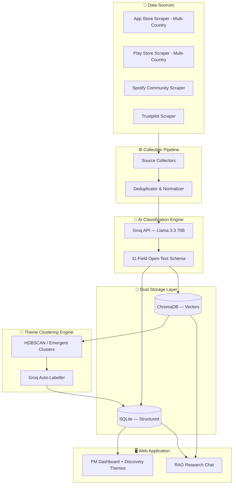
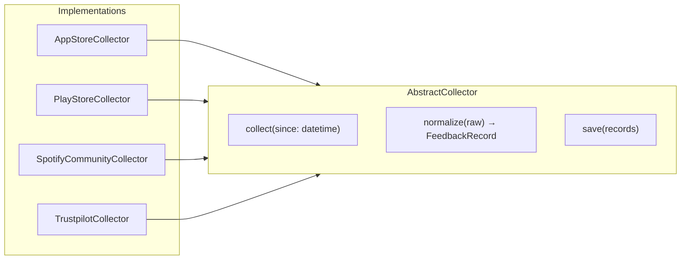
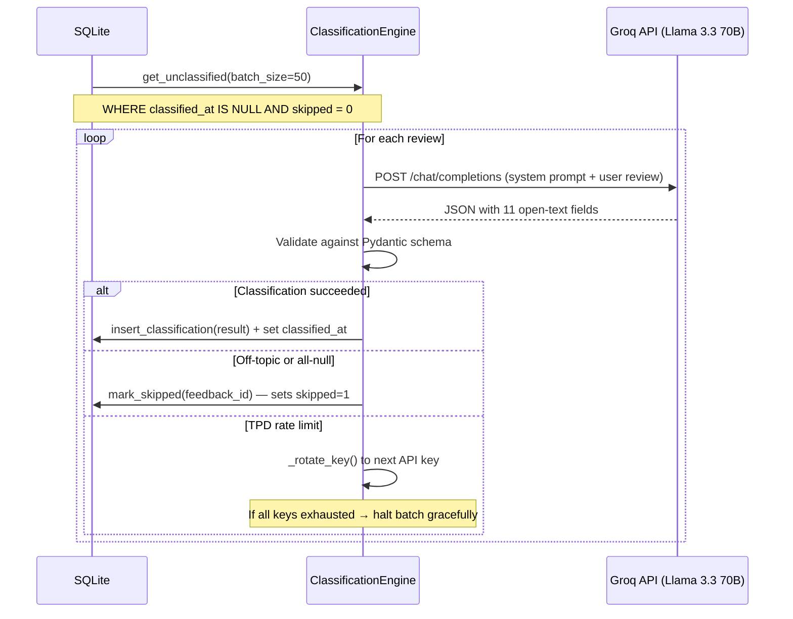
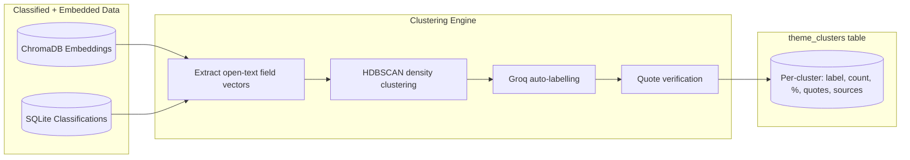
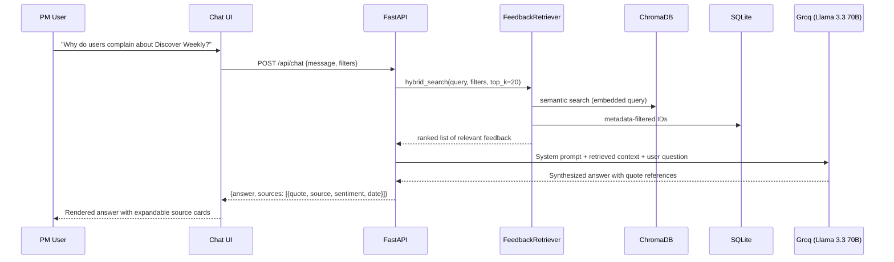
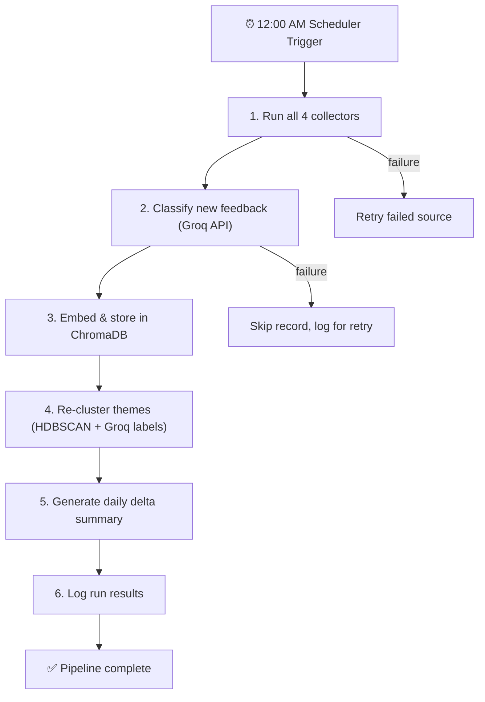
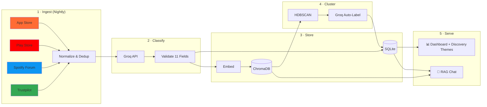

# Architecture — AI-Powered User Feedback Intelligence System

> **Version:** 1.0  
> **Last Updated:** 2026-06-17  
> **Status:** Design Phase

---

## Table of Contents

- [High-Level System Overview](#high-level-system-overview)
- [Tech Stack Summary](#tech-stack-summary)
- [Phase 1 — Foundation & Project Scaffolding](#phase-1--foundation--project-scaffolding)
- [Phase 2 — Data Collection Pipeline](#phase-2--data-collection-pipeline)
- [Phase 3 — AI Classification Engine](#phase-3--ai-classification-engine)
- [Phase 4 — Storage & Embedding Layer](#phase-4--storage--embedding-layer)
- [Phase 4.5 — Theme Clustering Engine](#phase-45--theme-clustering-engine)
- [Phase 5 — PM Dashboard (Frontend)](#phase-5--pm-dashboard-frontend)
- [Phase 6 — RAG-Powered Research Chat](#phase-6--rag-powered-research-chat)
- [Phase 7 — Automation, Scheduling & Production Hardening](#phase-7--automation-scheduling--production-hardening)
- [Directory Structure](#directory-structure)
- [Data Flow Summary](#data-flow-summary)

---

## High-Level System Overview



---

## Tech Stack Summary

| Layer                | Technology                        | Why                                                                   |
|----------------------|-----------------------------------|-----------------------------------------------------------------------|
| **Language**         | Python 3.11+                      | Rich ecosystem for NLP, scraping, and AI integration                  |
| **Web Framework**    | FastAPI                           | Async-first, auto-generated OpenAPI docs, high performance            |
| **Frontend**         | HTML + Vanilla JS + CSS           | Lightweight, no build step, fast iteration                            |
| **Charts**           | Chart.js                          | Simple, beautiful, responsive charts with animation                   |
| **Structured DB**    | SQLite (via `sqlite3`)            | Zero-config, local, fast for single-user analytical workloads         |
| **Vector DB**        | ChromaDB (local, persistent)      | Local embeddings + similarity search, no cloud cost                   |
| **Embeddings**       | `sentence-transformers` (all-MiniLM-L6-v2) | Fast, high-quality semantic embeddings, runs on CPU         |
| **LLM — Classify**  | Groq API (Llama 3.3 70B)         | Free tier, extremely fast inference, structured JSON output           |
| **LLM — RAG Chat**  | Groq API (Llama 3.3 70B)         | Same model for synthesis and answer generation                        |
| **Scraping**         | `httpx` + `BeautifulSoup4`        | Async HTTP + robust HTML parsing (used for Spotify Community & Trustpilot) |
| **App/Play Store**   | `google-play-scraper`, `httpx`             | Official RSS feed for App Store, community scraper for Play Store |
| **Clustering**       | `hdbscan` + `scikit-learn`        | Density-based clustering on existing embeddings — no predefined categories |
| **Scheduling**       | `APScheduler`                     | In-process cron-like scheduler, no external service needed            |
| **Task Runner**      | `asyncio`                         | Native Python async for concurrent scraping                           |

---

## Phase 1 — Foundation & Project Scaffolding

> **Goal:** Set up the project structure, database schemas, configuration system, and core data models so every subsequent phase has a solid foundation to build on.

### 1.1 Project Structure

Create the full directory tree (see [Directory Structure](#directory-structure) below) with placeholder `__init__.py` files and a `requirements.txt`.

### 1.2 Configuration System

**File:** `config/settings.py`

A centralized config using `pydantic-settings` that reads from a `.env` file:

```python
# Key configuration values
GROQ_API_KEY: str                            # Single-key fallback (retained for backward compatibility)
GROQ_API_KEYS: str = ""                      # Comma-separated list of Groq API keys for throughput rotation
APP_STORE_COUNTRIES: list[str] = ["US", "GB", "IN", "BR", "DE"]
PLAY_STORE_COUNTRIES: list[str] = ["US", "GB", "IN", "BR", "DE"]
SQLITE_DB_PATH: str = "data/feedback.db"
CHROMA_PERSIST_DIR: str = "data/chroma"
COLLECTION_INTERVAL_HOURS: int = 24
EMBEDDING_MODEL: str = "paraphrase-multilingual-MiniLM-L12-v2" # SentenceTransformers model for semantic search
GROQ_MODEL: str = "llama-3.3-70b-versatile"

# Collection & Classification Caps
MAX_RECORDS_PER_SOURCE_PER_RUN: int = 200    # Prevents collection flooding
MAX_CLASSIFICATIONS_PER_RUN: int = 900       # Leaves headroom under Groq's 1,000/day free tier
MIN_PATTERN_SAMPLE: int = 10                 # Minimum records to report a growing/fading trend
```

> **Multi-Key Groq Rotation:** `GROQ_API_KEYS` accepts a comma-separated list of API keys (e.g. `key1,key2,key3`). The classification engine initializes with all keys and rotates to the next one when the current key hits its daily token limit (TPD). If `GROQ_API_KEYS` is empty, the engine falls back to the single `GROQ_API_KEY`. **Design rule:** All keys use the same model (`llama-3.3-70b-versatile`) and the same prompt. Keys are a throughput mechanism only — never a model or quality variable.

### 1.3 SQLite Schema Design

**File:** `database/schema.sql`

```sql
-- Core feedback table
CREATE TABLE IF NOT EXISTS feedback (
    id              TEXT PRIMARY KEY,          -- UUID
    source          TEXT NOT NULL,             -- appstore | playstore | spotify_community | trustpilot
    source_id       TEXT NOT NULL,             -- Original ID from the source platform
    country         TEXT,                      -- 'US', 'GB', 'IN', etc. (for app stores)
    author          TEXT,
    content         TEXT NOT NULL,
    url             TEXT,
    posted_at       TIMESTAMP,
    collected_at    TIMESTAMP DEFAULT CURRENT_TIMESTAMP,
    classified_at   TIMESTAMP,
    skipped         BOOLEAN DEFAULT 0,         -- 1 = model returned off-topic/all-null; retained for audit, excluded from clustering
    raw_json        TEXT,                      -- Original API response stored for auditability
    UNIQUE(source, source_id)                  -- Prevents duplicate ingestion
);

-- AI classification results (1:1 with feedback)
CREATE TABLE IF NOT EXISTS classifications (
    feedback_id             TEXT PRIMARY KEY REFERENCES feedback(id),
    topic                   TEXT,                           -- open text: what the review is about
    core_complaint          TEXT,                           -- open text: main grievance, or NULL if positive
    trust_level             TEXT CHECK(trust_level IN ('high','medium','low','broken')),
    sentiment               TEXT CHECK(sentiment IN ('positive','negative','mixed','neutral')),
    frustration_intensity   TEXT CHECK(frustration_intensity IN ('mild','moderate','severe','churned')),
    user_job_to_be_done     TEXT,
    repeat_listen_reason    TEXT,                           -- open text: why user repeats, or NULL
    workaround_mentioned    BOOLEAN DEFAULT 0,
    workaround_description  TEXT,
    behaviour_pattern       TEXT,                           -- open text: model describes user behaviour
    pattern_evidence        TEXT,                           -- one sentence from source text
    quote_translated        TEXT,                           -- English translation of pattern_evidence
    unmet_need              TEXT,
    classified_at           TIMESTAMP DEFAULT CURRENT_TIMESTAMP
);

-- Collection run log (tracks daily runs for incremental collection)
CREATE TABLE IF NOT EXISTS collection_runs (
    id              INTEGER PRIMARY KEY AUTOINCREMENT,
    source          TEXT NOT NULL,
    started_at      TIMESTAMP DEFAULT CURRENT_TIMESTAMP,
    completed_at    TIMESTAMP,
    records_fetched INTEGER DEFAULT 0,
    records_new     INTEGER DEFAULT 0,
    status          TEXT CHECK(status IN ('running','success','failed')),
    error_message   TEXT
);

-- Daily delta summaries (auto-generated after each nightly run)
CREATE TABLE IF NOT EXISTS daily_summaries (
    id              INTEGER PRIMARY KEY AUTOINCREMENT,
    summary_date    DATE NOT NULL UNIQUE,
    total_new       INTEGER,
    by_source       TEXT,              -- JSON: {"appstore": 12, "playstore": 5, "trustpilot": 2}
    by_topic        TEXT,              -- JSON: open-text tallied, e.g. {"Discover Weekly feels stale": 8, "shuffle keeps repeating": 5, ...}
    top_complaints  TEXT,              -- JSON array of top 5 core_complaint values (illustrative only — values are open text, not a fixed list)
    growing_patterns TEXT,             -- JSON array of patterns trending up
    fading_patterns  TEXT,             -- JSON array of patterns trending down
    generated_at    TIMESTAMP DEFAULT CURRENT_TIMESTAMP
);

-- Theme clusters (emergent, not predefined — populated by Phase 4.5 clustering engine)
CREATE TABLE IF NOT EXISTS theme_clusters (
    id              INTEGER PRIMARY KEY AUTOINCREMENT,
    cluster_type    TEXT NOT NULL,             -- 'topic' | 'complaint' | 'behaviour' | 'unmet_need'
    label           TEXT NOT NULL,             -- auto-generated by Groq from cluster members
    member_count    INTEGER NOT NULL,
    percentage      REAL NOT NULL,             -- % of total classified reviews
    representative_quotes TEXT,                -- JSON array of 3-5 verified verbatim quotes
    sources_breakdown TEXT,                    -- JSON: {"appstore": 12, "playstore": 5, ...}
    countries_breakdown TEXT,                  -- JSON: {"US": 8, "GB": 4, ...}
    member_ids      TEXT,                      -- JSON array of feedback_ids in this cluster
    clustered_at    TIMESTAMP DEFAULT CURRENT_TIMESTAMP,
    run_id          INTEGER                    -- links to clustering_runs.id
);

-- Clustering run log (tracks each batch clustering execution)
CREATE TABLE IF NOT EXISTS clustering_runs (
    id              INTEGER PRIMARY KEY AUTOINCREMENT,
    started_at      TIMESTAMP DEFAULT CURRENT_TIMESTAMP,
    completed_at    TIMESTAMP,
    total_records   INTEGER,
    clusters_found  INTEGER,
    cluster_types   TEXT,                      -- JSON array of types clustered
    status          TEXT CHECK(status IN ('running','success','failed')),
    error_message   TEXT
);

-- Indexes for dashboard query performance
CREATE INDEX IF NOT EXISTS idx_feedback_source ON feedback(source);
CREATE INDEX IF NOT EXISTS idx_feedback_posted ON feedback(posted_at);
CREATE INDEX IF NOT EXISTS idx_feedback_skipped ON feedback(skipped);
CREATE INDEX IF NOT EXISTS idx_class_topic ON classifications(topic);
CREATE INDEX IF NOT EXISTS idx_class_sentiment ON classifications(sentiment);
CREATE INDEX IF NOT EXISTS idx_class_intensity ON classifications(frustration_intensity);
CREATE INDEX IF NOT EXISTS idx_class_behaviour ON classifications(behaviour_pattern);
CREATE INDEX IF NOT EXISTS idx_theme_type ON theme_clusters(cluster_type);
CREATE INDEX IF NOT EXISTS idx_theme_run ON theme_clusters(run_id);
```

### 1.4 Core Data Models

**File:** `models/feedback.py`

Pydantic models mirroring the database schema for type-safe data flow:

- `FeedbackRecord` — raw collected feedback
- `ClassificationResult` — the 11-field open-text classification output
- `ClassifiedFeedback` — joined model for API responses
- `CollectionRunLog` — metadata for each scraping run

### 1.5 Database Manager

**File:** `database/db_manager.py`

A singleton `DatabaseManager` class:
- `initialize()` — creates tables from schema.sql
- `insert_feedback(record)` — upserts with dedup on `(source, source_id)`
- `insert_classification(result)` — stores AI classification
- `get_unclassified()` — returns feedback records where `classified_at IS NULL AND skipped = 0`
- `mark_skipped(feedback_id)` — sets `skipped = 1` on a review (off-topic/all-null); retained for audit, excluded from future classification runs and clustering
- `query_dashboard(filters)` — parameterized queries for the dashboard
- `get_last_collection_time(source)` — returns the timestamp of last successful run per source

### Phase 1 Deliverables

- [x] Full directory structure created
- [x] `.env.example` with all required keys
- [x] `requirements.txt` with pinned versions
- [x] SQLite schema with all tables and indexes
- [x] Pydantic data models
- [x] DatabaseManager with full CRUD
- [x] Unit tests for DB operations

---

## Phase 2 — Data Collection Pipeline

> **Goal:** Build collectors for all 4 sources that support incremental collection (only fetching new data since the last run) and normalize everything into a unified `FeedbackRecord` format.

### 2.1 Collector Architecture



**File:** `collectors/base_collector.py`

```python
class AbstractCollector(ABC):
    source_name: str

    async def run(self) -> CollectionRunLog:
        """Orchestrates: get last timestamp → collect since (capped at MAX_RECORDS_PER_SOURCE_PER_RUN) → normalize → dedup → save → log."""

    @abstractmethod
    async def collect(self, since: datetime) -> list[dict]:
        """Fetch raw data from the source since the given timestamp."""

    @abstractmethod
    def normalize(self, raw: dict) -> FeedbackRecord:
        """Transform source-specific format into unified FeedbackRecord."""
```

### 2.2 Source-Specific Collectors

| Source               | File                              | Strategy                                                                    |
|----------------------|-----------------------------------|-----------------------------------------------------------------------------|
| **App Store**        | `collectors/appstore_collector.py`| Official Apple RSS feed via `httpx` — fetches reviews for Spotify's App Store ID, iterating over `APP_STORE_COUNTRIES`. Endpoint: `itunes.apple.com/{country}/rss/customerreviews/id=324684580/sortBy=mostRecent/json` |
| **Play Store**       | `collectors/playstore_collector.py`| `google-play-scraper` — `reviews()` for `com.spotify.music`, pulling from configured `PLAY_STORE_COUNTRIES`. Sorted by newest. |
| **Spotify Community**| `collectors/spotify_community_collector.py` | `httpx` + `BeautifulSoup4` — scrape community.spotify.com forum threads in "Music Discovery" and "Your Library" categories. |
| **Trustpilot**       | `collectors/trustpilot_collector.py` | `httpx` + `BeautifulSoup4` — scrape Trustpilot public reviews for Spotify. **⚠️ Optional / non-critical source:** If layout changes break the scraper, fail gracefully and continue pipeline. |

### 2.3 Collection Orchestrator

**File:** `collectors/orchestrator.py`

```python
class CollectionOrchestrator:
    async def run_all(self) -> dict:
        """Run all collectors concurrently with asyncio.gather, log results.
        Enforces MAX_RECORDS_PER_SOURCE_PER_RUN cap per collector.
        Treats Trustpilot as optional (errors logged, not propagated)."""

    async def run_source(self, source: str) -> CollectionRunLog:
        """Run a single collector by name (useful for manual re-runs)."""
```

### 2.4 Deduplication Strategy

- **Primary dedup:** `UNIQUE(source, source_id)` constraint in SQLite — `INSERT OR IGNORE`.
- **Content-level dedup:** Before inserting, compute a hash of `content` text. Store in a `content_hash` column. Skip if hash already exists (catches cross-platform reposts).
- **Rate limiting:** Each collector implements per-source rate limits to respect API quotas.

### Phase 2 Deliverables

- [ ] `AbstractCollector` base class with lifecycle hooks
- [ ] 4 source-specific collector implementations
- [ ] `CollectionOrchestrator` for concurrent runs
- [ ] Dedup logic (source_id + content hash)
- [ ] Rate limiting per source
- [ ] Integration tests with mock data per source
- [ ] CLI command: `python -m app.collect --source appstore` (or `--all`)

---

## Phase 3 — AI Classification Engine

> **Goal:** Build the classification pipeline that takes unclassified feedback and uses the Groq API (Llama 3.3 70B) to extract 11 open-text fields in a single structured JSON call per record. The model describes what it sees — it does not sort reviews into predefined buckets.

### 3.1 Classification Flow



### 3.2 Multi-Key Groq Rotation

The engine supports a configurable list of Groq API keys to multiply daily throughput:

1. **Initialization:** Reads `GROQ_API_KEYS` (comma-separated). Falls back to single `GROQ_API_KEY` if the list is empty.
2. **Rotation trigger:** Only on **TPD errors** (daily token limit exhaustion). Short-interval 429s (requests-per-minute throttles) are handled by the Groq client's built-in retry logic and do **not** trigger rotation.
3. **Rotation behavior:** `_rotate_key()` increments to the next key in the list and swaps the Groq client instance. The review that triggered the TPD error is retried on the new key without penalty to the retry counter.
4. **Exhaustion:** When all keys are exhausted, the batch halts gracefully, saves progress, and logs the remaining count. Unclassified reviews stay in the queue (`classified_at = NULL, skipped = 0`) for the next run.
5. **Design rule:** All keys use the same model (`llama-3.3-70b-versatile`) and the identical trimmed prompt. Keys are a throughput mechanism only — never a model or quality variable. Corpus consistency is non-negotiable.

### 3.3 Prompt Design

**File:** `classifier/prompts.py`

The system prompt is the heart of the classification quality. Key design principles:

```
SYSTEM PROMPT (condensed):

You are a user feedback analyst specializing in music discovery behavior.
Given a user review about Spotify, extract the following 11 fields.
Return ONLY valid JSON matching the schema below. If a field is not
clearly present in the text, use null.

Do NOT sort reviews into predefined categories. Describe what is
actually in the text. Return null when something is not present.

Schema:
{
  "topic": "string | null — what is this review about, in your own words?",
  "core_complaint": "string | null — the user's main grievance, described naturally",
  "trust_level": "high | medium | low | broken | null",
  "sentiment": "positive | negative | mixed | neutral",
  "frustration_intensity": "mild | moderate | severe | churned | null",
  "user_job_to_be_done": "string | null — 'The user wants to [GOAL] in [CONTEXT] without [FRICTION]'",
  "repeat_listen_reason": "string | null — why does the user keep replaying the same music, in their own words?",
  "workaround_mentioned": "boolean",
  "workaround_description": "string | null",
  "behaviour_pattern": "string | null — describe the user's discovery behaviour in your own words",
  "pattern_evidence": "string — one verbatim sentence from the source text that supports the pattern",
  "unmet_need": "string | null — 'User needs [X] but the product currently [Y]'"
}
```

### 3.4 Classification Engine

**File:** `classifier/engine.py`

```python
class ClassificationEngine:
    def __init__(self, db: DatabaseManager):
        # Reads GROQ_API_KEYS (comma-separated list) or falls back to single GROQ_API_KEY
        # All keys use the same model and prompt — keys are throughput only
        ...

    async def classify_batch(self, limit: int = None) -> int:
        """Fetch up to `limit` (default: MAX_CLASSIFICATIONS_PER_RUN=900) unclassified records
        (oldest first, excluding skipped), classify via Groq, store results.
        Rotates API keys on TPD exhaustion. Returns count classified."""

    async def classify_single(self, content: str, feedback_id: str) -> ClassificationResult | None:
        """Classify a single review. Returns ClassificationResult on success,
        None on off-topic/all-null (caller marks as skipped) or TPD limit."""

    def _rotate_key(self) -> bool:
        """Switch to the next API key. Returns True if a key was available, False if all exhausted."""

    def _build_messages(self, content: str) -> list[dict]:
        """Build the system + few-shot + user message list."""

    def _parse_and_validate(self, raw_json: str, feedback_id: str) -> ClassificationResult:
        """Parse JSON string, fuzzy-map enum values, validate with Pydantic."""
```

### 3.5 Skip Flag & Audit

Reviews where the model returns `None` for content reasons (off-topic, all meaningful fields null) are marked `skipped = 1` in the `feedback` table via `db.mark_skipped(feedback_id)`. This means:
- **Retained:** The review text stays in the database for audit and is recoverable.
- **Excluded:** `get_unclassified()` filters `WHERE skipped = 0`, so skipped reviews are never re-attempted. Clustering and dashboard queries exclude `skipped = 1` rows.
- **Not confused with TPD failures:** A TPD-caused `None` does **not** set `skipped = 1` — the review stays in the queue (`classified_at = NULL, skipped = 0`) for the next run with fresh API key quota.

### 3.6 Error Handling & Resilience

| Scenario                     | Strategy                                                        |
|------------------------------|-----------------------------------------------------------------|
| Groq returns invalid JSON    | Retry up to 2 times with a stricter prompt appending `"Return ONLY JSON."` |
| Groq RPM rate limit (429)    | Groq client auto-retries with 1-2s backoff (does NOT trigger key rotation) |
| Groq TPD daily limit (429)   | Rotate to next API key via `_rotate_key()`. If all keys exhausted, halt batch gracefully |
| Groq timeout                 | 30-second timeout per request, skip record and log for retry     |
| Dimension value out of enum  | Fuzzy-map common variants (e.g. `"very low"` → `"low"`), then Pydantic validation |
| Content too short (<20 chars) | Skip classification, return None                                 |
| Off-topic / all-null          | Return None → caller marks `skipped = 1` (retained for audit)  |

### Phase 3 Deliverables

- [ ] System prompt with all 11 open-text extraction fields
- [ ] `ClassificationEngine` with batch + single classification
- [ ] Multi-key Groq rotation (TPD-triggered, configurable key count)
- [ ] Skip flag (`skipped` column) for off-topic/all-null reviews
- [ ] Pydantic validation of Groq responses
- [ ] Retry logic with exponential backoff
- [ ] Batch processing with configurable batch size
- [ ] Logging of classification quality metrics (% valid responses, % null per dimension)
- [ ] CLI command: `python -m app.classify --batch-size 50`

---

## Phase 4 — Storage & Embedding Layer

> **Goal:** Set up ChromaDB for vector storage alongside SQLite, build the embedding pipeline, and create a unified retrieval interface that powers both the dashboard queries and the RAG chat.

### 4.1 Dual Storage Architecture

```mermaid
graph TB
    subgraph Write Path
        CF[Classified Feedback]
        CF -->|structured fields| SQL[(SQLite)]
        CF -->|content + metadata| EMB[Embedding Pipeline]
        EMB -->|vector + metadata| VEC[(ChromaDB)]
    end

    subgraph Read Path — Dashboard
        DASH[Dashboard API] -->|SQL queries with filters| SQL
    end

    subgraph Read Path — RAG Chat
        QUERY[User Question]
        QUERY -->|embed query| VEC
        VEC -->|top-k similar docs| CTX[Context Builder]
        QUERY -->|filter params| SQL
        SQL -->|filtered IDs| CTX
        CTX -->|context + question| LLM[Groq LLM]
        LLM -->|synthesized answer| RESP[Response]
    end
```

### 4.2 Embedding Pipeline

**File:** `embeddings/embed_pipeline.py`

```python
class EmbeddingPipeline:
    def __init__(self, model_name: str = "paraphrase-multilingual-MiniLM-L12-v2"):
        self.model = SentenceTransformer(model_name)
        self.chroma_client = chromadb.PersistentClient(path=CHROMA_PERSIST_DIR)
        self.collection = self.chroma_client.get_or_create_collection(
            name="feedback",
            metadata={"hnsw:space": "cosine"}
        )

    def embed_and_store(self, records: list[ClassifiedFeedback]) -> int:
        """Embed content and upsert into ChromaDB with metadata filters."""

    def query(self, text: str, n_results: int = 20, filters: dict = None) -> list:
        """Semantic search with optional metadata filtering."""
```

### 4.3 ChromaDB Metadata Schema

Each document stored in ChromaDB includes metadata for filtered retrieval:

```python
# Example — values are illustrative only; all open-text fields are free-form,
# not drawn from a fixed vocabulary.
{
    "id": "uuid",
    "document": "full review text",
    "metadata": {
        "source": "appstore",
        "posted_at": "2026-06-15T10:30:00",
        "topic": "Discover Weekly stopped surprising me",
        "core_complaint": "every week it suggests the same artists I already listen to",
        "sentiment": "negative",
        "frustration_intensity": "severe",
        "trust_level": "low",
        "behaviour_pattern": "gave up on algorithmic playlists and builds manual ones from SoundCloud finds",
        "workaround_mentioned": True,
        "has_unmet_need": True
    }
}
```

### 4.4 Retrieval Interface

**File:** `retrieval/retriever.py`

A unified retrieval layer used by both the dashboard and the RAG chat:

```python
class FeedbackRetriever:
    def __init__(self, db_manager, embedding_pipeline):
        ...

    def structured_query(self, filters: DashboardFilters) -> list[ClassifiedFeedback]:
        """SQL-based query for dashboard (fast, exact filters)."""

    def semantic_search(self, query: str, filters: ChatFilters, top_k: int = 20) -> list[ClassifiedFeedback]:
        """Vector similarity search with metadata pre-filtering for RAG chat."""

    def hybrid_search(self, query: str, filters: ChatFilters, top_k: int = 20) -> list[ClassifiedFeedback]:
        """Combines semantic results with SQL results, re-ranks by relevance score."""
```

### Phase 4 Deliverables

- [ ] ChromaDB setup with persistent local storage
- [ ] Embedding pipeline using `sentence-transformers`
- [ ] Metadata schema for filtered vector search
- [ ] `FeedbackRetriever` with structured, semantic, and hybrid search
- [ ] Backfill script to embed all existing classified feedback
- [ ] CLI command: `python -m app.embed --backfill`

---

## Phase 4.5 — Theme Clustering Engine

> **Goal:** Group the open-text classification fields into emergent themes so the dashboard can answer pattern-level questions ("what are the most common frustrations?", "which user segments face different challenges?") instead of showing thousands of unique strings.
>
> **Critical design constraint:** Clusters must EMERGE from the data, not be predefined. Do NOT hardcode expected segments, frustration categories, or theme lists anywhere. The clustering groups whatever is actually in the data, then auto-labels the resulting groups. This preserves the same open-extraction principle that governs the classifier — imposing predefined buckets would reintroduce the exact confirmation bias the system was built to avoid.

### 4.5.1 Clustering Architecture



### 4.5.2 Clustering Process

**File:** `app/clustering/engine.py`

```python
class ThemeClusteringEngine:
    def __init__(self, db: DatabaseManager, embedding_pipeline: EmbeddingPipeline):
        self.db = db
        self.ep = embedding_pipeline
        self.groq_client = Groq(api_key=settings.GROQ_API_KEY)

    async def run_clustering(self, cluster_types: list[str] = None) -> dict:
        """
        Cluster open-text fields into emergent themes.
        
        cluster_types: which fields to cluster. Defaults to all:
            ['topic', 'core_complaint', 'behaviour_pattern', 'unmet_need']
        
        For each field:
        1. Pull all non-null values from classifications table
        2. Embed each value using sentence-transformers (reuses existing model)
        3. Run HDBSCAN to find density-based clusters (no predefined k)
        4. For each cluster, auto-generate a label via Groq
        5. Select 3-5 representative quotes (verified against source text)
        6. Compute source/country breakdown
        7. Store in theme_clusters table
        
        Returns summary dict with cluster counts per type.
        """

    def _cluster_field(self, field_name: str, values: list[dict]) -> list[dict]:
        """Run HDBSCAN on embeddings for one field. Returns raw cluster assignments."""

    async def _auto_label_cluster(self, member_values: list[str]) -> str:
        """
        Send cluster members to Groq with prompt:
        'These user complaints/patterns were grouped together by semantic similarity.
         Give a short, neutral label (3-8 words) describing the common theme.
         Do NOT impose a predefined category — describe what is actually there.'
        """

    def _select_representative_quotes(self, cluster_feedback_ids: list[str], n: int = 5) -> list[str]:
        """Select quotes closest to cluster centroid. Verify each against source text."""
```

### 4.5.3 Clustering Configuration

Added to `config/settings.py`:

```python
# Clustering
MIN_CLUSTER_SIZE: int = 5          # HDBSCAN minimum cluster size
MIN_SAMPLES: int = 3               # HDBSCAN min_samples parameter
CLUSTER_FIELDS: list[str] = ["topic", "core_complaint", "behaviour_pattern", "unmet_need"]
```

### 4.5.4 How Clusters Map to the Brief's Questions

| Brief Question | Cluster Type | What the Dashboard Shows |
|---|---|---|
| **Why do users struggle to discover new music?** | `topic` clusters | Emergent topic themes ranked by frequency |
| **Most common frustrations** | `core_complaint` clusters | Complaint themes with counts, %, and representative quotes |
| **Behaviours users want from discovery** | `behaviour_pattern` clusters | Behavioural themes showing how users actually interact |
| **Why do users listen to the same songs repeatedly?** | `topic` + `core_complaint` clusters filtered for repeat-listening themes | Themes where `repeat_listen_reason` is non-null |
| **Which user segments face different challenges?** | `behaviour_pattern` clusters | Each cluster IS a segment — users who share a behaviour pattern |
| **Consistent unmet needs** | `unmet_need` clusters | Need themes with frequency, showing which gaps persist across sources |

> **Quality Guardrail:** The embedding model must be cross-lingual (e.g., `paraphrase-multilingual-MiniLM-L12-v2`). Monolingual models cluster text by language rather than meaning, which would cause HDBSCAN to create false "German clusters" or "Portuguese clusters" instead of genuine theme clusters spanning across markets.

### 4.5.5 Storage Schema

See the `theme_clusters` and `clustering_runs` tables in [Section 1.3](#13-sqlite-schema-design).

Key design decisions:
- **`cluster_type`** distinguishes which field was clustered (topic vs. complaint vs. behaviour vs. unmet_need)
- **`representative_quotes`** stores verified verbatim quotes (same validation as RAG chat — no fabricated text)
- **`sources_breakdown`** and **`countries_breakdown`** let the dashboard show geographic/platform distribution per theme
- **`member_ids`** preserves traceability to individual reviews
- Each clustering run replaces old clusters (re-runnable as new data arrives)

### Phase 4.5 Deliverables

- [ ] `clustering/engine.py` — ThemeClusteringEngine with HDBSCAN + Groq auto-labelling
- [ ] `clustering/prompts.py` — Labelling prompts (open-ended, no predefined categories)
- [ ] `theme_clusters` and `clustering_runs` SQLite tables
- [ ] CLI command: `python -m app.cluster`
- [ ] Re-runnable: new run replaces old clusters with fresh analysis
- [ ] Representative quotes verified against source text
- [ ] Tests verifying no hardcoded category lists exist

---

## Phase 5 — PM Dashboard (Frontend)

> **Goal:** Build a two-page web application served by FastAPI. Page 1 is the PM analytics dashboard, including a "Discovery Themes" view powered by the clustering engine.
>
> The dashboard converts the tool from a "data browser" into a "discovery engine" by visibly answering the brief's six questions: why users struggle, common frustrations, desired behaviours, repeat-listening causes, user segments, and unmet needs — each with counts, percentages, and representative quotes.

### 5.1 Dashboard Layout

```
┌─────────────────────────────────────────────────────────────────┐
│  🎵 AI Feedback Intelligence        [Dashboard] [Research Chat] │
├─────────────────────────────────────────────────────────────────┤
│  Filters: [Date Range ▾] [Platform ▾] [Sentiment ▾] [Topic ▾] │
├──────────────────────┬──────────────────────────────────────────┤
│  📊 Sentiment        │  🔥 Top Complaints (with Δ week/week)   │
│  Distribution        │     ┌──────────────────────────┐        │
│  (Donut Chart)       │     │ Same songs repeating ↑12%│        │
│                      │     │ Can't find new stuff ↓3% │        │
│                      │     │ Playlists too short  ↑8% │        │
│                      │     └──────────────────────────┘        │
├──────────────────────┼──────────────────────────────────────────┤
│  🚧 Common           │  🔧 Workaround Tracker                  │
│  Topics              │     "I made a burner playlist to..."    │
│  (Horizontal Bar)    │     "I use a third-party app to..."     │
│                      │     "I manually search SoundCloud for..." │
├──────────────────────┴──────────────────────────────────────────┤
│  📈 Top Topics Over Time (Line Chart — 30 days)                │
│  ──────────────────────────────────────────────────────────     │
├─────────────────────────────────────────────────────────────────┤
│  💬 Verbatim Quotes Feed (paginated, filterable)               │
│  ┌─────────────────────────────────────────────────────────┐   │
│  │ "Discover Weekly used to be amazing but now it just..." │   │
│  │  📍 App Store · Negative · Severe · 2 days ago         │   │
│  └─────────────────────────────────────────────────────────┘   │
└─────────────────────────────────────────────────────────────────┘
```

### 5.2 Dashboard API Endpoints

**File:** `api/dashboard_routes.py`

| Endpoint                          | Method | Response                                              |
|-----------------------------------|--------|-------------------------------------------------------|
| `/api/dashboard/summary`          | GET    | Total feedback, count by source, count by sentiment   |
| `/api/dashboard/topics`           | GET    | Most common topics with counts and percentages        |
| `/api/dashboard/complaints`       | GET    | Top core complaints with week-over-week delta         |
| `/api/dashboard/behaviours`       | GET    | Common behaviour patterns extracted                   |
| `/api/dashboard/workarounds`      | GET    | Workaround descriptions with metadata                 |
| `/api/dashboard/trends`           | GET    | Topic/complaint time-series data (daily counts, 30 days)  |
| `/api/dashboard/quotes`           | GET    | Paginated verbatim quotes with classification metadata|
| `/api/dashboard/themes`           | GET    | Emergent theme clusters: `{cluster_type, label, count, percentage, quotes, sources}[]` |
| `/api/dashboard/themes/:type`     | GET    | Clusters for a specific type (topic, complaint, behaviour, unmet_need) |

All endpoints accept query params: `date_from`, `date_to`, `source`, `sentiment`, `topic`.

### 5.3 Frontend Stack

| Component         | Tech                                    |
|--------------------|-----------------------------------------|
| Layout             | Semantic HTML5 + CSS Grid/Flexbox       |
| Styling            | Vanilla CSS with CSS custom properties  |
| Charts             | Chart.js (donut, bar, line)             |
| Interactivity      | Vanilla JS (fetch API, DOM manipulation)|
| Icons              | Inline SVG or emoji                     |
| Fonts              | Google Fonts — Inter                    |

### 5.4 Design System

```css
:root {
    /* Dark theme base */
    --bg-primary: #0a0a0f;
    --bg-card: #12121a;
    --bg-card-hover: #1a1a28;
    --border: #1e1e2e;

    /* Accent palette */
    --accent-green: #1db954;     /* Spotify green */
    --accent-purple: #7c3aed;
    --accent-blue: #3b82f6;
    --accent-orange: #f59e0b;
    --accent-red: #ef4444;
    --accent-pink: #ec4899;

    /* Text */
    --text-primary: #f0f0f5;
    --text-secondary: #8888a0;
    --text-muted: #555566;

    /* Glassmorphism */
    --glass-bg: rgba(18, 18, 26, 0.7);
    --glass-border: rgba(255, 255, 255, 0.06);
    --glass-blur: blur(16px);
}
```

### 5.5 Discovery Themes View

A dedicated section of the dashboard that displays emergent clusters from Phase 4.5:

```
┌─────────────────────────────────────────────────────────────────┐
│  🔬 Discovery Themes                                           │
├─────────────────────────────────────────────────────────────────┤
│  [Frustrations ▾] [User Segments ▾] [Unmet Needs ▾]            │
├────────────────────────┬────────────────────────────────────────┤
│  🏷️ Theme Clusters      │  📊 Theme Detail                      │
│  (ranked by frequency)  │                                       │
│                         │  "Algorithm feels stuck in a loop"     │
│  ■ Algorithm loop (34%) │   134 reviews · 34% of total          │
│  ■ Same songs (21%)     │   Sources: App Store (45%), Play (38%)│
│  ■ Genre bubble (15%)   │   Countries: US (52%), GB (18%)       │
│  ■ Can't find new (12%) │                                       │
│  ■ ... emergent ...     │   Representative quotes:              │
│                         │   • "DW keeps giving me the same..." │
│  (labels auto-generated │   • "Every week it's the same 5..."  │
│   — not predefined)     │   • "Stuck in an echo chamber..."    │
├─────────────────────────┴────────────────────────────────────────┤
│  ℹ️ These themes emerged from clustering — they were NOT        │
│  predefined. Labels were auto-generated by AI from the data.   │
└─────────────────────────────────────────────────────────────────┘
```

### Phase 5 Deliverables

- [ ] FastAPI app serving static HTML/CSS/JS
- [ ] 9 dashboard API endpoints with filtering (7 original + 2 theme endpoints)
- [ ] Charts reflecting quotes and tallies
- [ ] **Discovery Themes view** showing emergent clusters with counts, %, and quotes
- [ ] Themes mapped to brief's 6 questions (frustrations, segments, unmet needs, etc.)
- [ ] Workaround tracker with verbatim text
- [ ] Paginated quotes feed with source badges and pattern tags
- [ ] Global filter bar (date, platform, sentiment, topic)
- [ ] Dark theme with glassmorphism aesthetic
- [ ] Fully responsive layout

---

## Phase 6 — RAG-Powered Research Chat

> **Goal:** Build Page 2 of the web app — a chat interface where PMs ask natural language questions and receive synthesized answers grounded in sourced user quotes.

### 6.1 RAG Pipeline Architecture



### 6.2 RAG System Prompt

```
SYSTEM PROMPT (condensed):

You are a user research assistant for a music product team.
You answer questions by synthesizing insights from real user feedback.

RULES:
1. Ground every claim in specific user quotes from the provided context.
2. Cite quotes using [Source: platform, Sentiment: value, Date: date] format.
3. If the context doesn't contain enough information, say so honestly.
4. Identify patterns across multiple quotes when possible.
5. Never invent quotes or make claims not supported by the provided context.
6. Structure your answers with clear sections when addressing complex questions.
```

### 6.3 Chat API Endpoints

**File:** `api/chat_routes.py`

> **v1 Note:** Streaming (SSE) and multi-turn conversation context are cut from v1 to reduce complexity. The chat is single-turn request/response. These can be added as future enhancements if needed.

| Endpoint              | Method | Request Body                                          | Response                                    |
|------------------------|--------|-------------------------------------------------------|---------------------------------------------|
| `/api/chat`           | POST   | `{message, filters: {date_range, source, topic, sentiment, signal_type}}` | `{answer, sources: [...], metadata}` |
| `/api/chat/suggest`   | GET    | —                                                     | `{suggestions: ["What do...", "Why do..."]}` |

### 6.4 Filter Options for Chat

| Filter               | Options                                                                 |
|------------------------|-------------------------------------------------------------------------|
| **Date Range**        | Today, Last 7 days, Last 30 days, Custom range                         |
| **Platform**          | All, App Store, Play Store, Spotify Community, Trustpilot   |
| **Sentiment**         | All, Positive, Negative, Mixed, Neutral                                 |
| **Topic**             | Open search, or top extracted themes                                    |
| **Signal Type**       | All, Workarounds Only, Churned Users Only, High Frustration Only        |

### 6.5 Verbatim Quote Validation

Every quote the LLM returns in its answer must be verified against the source context before being shown to the user:

1. After the LLM generates its answer, extract all quoted strings
2. For each quote, check if a whitespace-normalized, case-insensitive substring match exists in any of the retrieved source documents
3. Drop any quote that doesn't match — replace it with `[quote could not be verified]`
4. This guarantees every quote shown to a PM is real, not hallucinated

This is the single biggest credibility upgrade in the system. A PM who sees a fabricated quote will never trust the tool again.

### 6.6 Chat UI Layout

```
┌─────────────────────────────────────────────────────────────────┐
│  🎵 AI Feedback Intelligence        [Dashboard] [Research Chat] │
├───────────────────────┬─────────────────────────────────────────┤
│  Filters              │  Chat Thread                            │
│                       │                                         │
│  📅 Date Range        │  🤖 Welcome! Ask me anything about      │
│  [Last 7 days ▾]     │     user feedback on music discovery.   │
│                       │                                         │
│  📍 Platform          │  👤 "What barriers do users hit          │
│  [All ▾]             │     with Discover Weekly?"               │
│                       │                                         │
│  👥 Sentiment         │  🤖 Based on 23 relevant reviews...     │
│  [All ▾]             │     [Synthesized answer with quotes]    │
│                       │     ┌──────────────────────────┐        │
│  😤 Topic             │     │ 📌 Source: App Store      │        │
│  [All ▾]             │     │ "DW keeps giving me..."  │        │
│                       │     │ Negative · Severe · 3d   │        │
│  🎯 Signal Type       │     └──────────────────────────┘        │
│  [All ▾]             │                                         │
│                       │  ┌──────────────────────────────────┐   │
│  💡 Suggested:        │  │  Ask a question...          [Send]│   │
│  • "Why do users..."  │  └──────────────────────────────────┘   │
│  • "What workarounds" │                                         │
└───────────────────────┴─────────────────────────────────────────┘
```

### Phase 6 Deliverables

- [ ] RAG pipeline: retrieve → build context → generate
- [ ] Chat API endpoint with filter support
- [ ] Suggested questions endpoint
- [ ] Chat UI with message rendering and source cards
- [ ] Source cards with expandable quotes
- [ ] Filter sidebar with all 5 filter dimensions
- [ ] **Verbatim quote validation** — post-generation check ensuring every quote matches a real source document
- [ ] ~~Streaming response support (SSE)~~ → **Deferred to v2**
- [ ] ~~Conversation context (last 5 messages)~~ → **Deferred to v2**

---

## Phase 7 — Automation, Scheduling & Production Hardening

> **Goal:** Wire everything together into a nightly pipeline that runs on schedule **while the server process is alive**, add health monitoring, and polish for daily use.
>
> **⚠️ Honest automation note:** APScheduler runs in-process. The pipeline fires only if the server is running at the scheduled time. For a fellowship demo, this is fine — just state clearly that the pipeline "runs on schedule while the server is running." For true always-on, deploy to Railway or Render free tier so the process runs continuously.

### 7.1 Nightly Pipeline



**File:** `scheduler/pipeline.py`

```python
class NightlyPipeline:
    async def run(self):
        """Execute the full nightly pipeline."""
        # 1. Collect from all sources
        collection_results = await orchestrator.run_all()
        # 2. Classify unclassified feedback
        classified_count = await classifier.classify_batch()
        # 3. Embed newly classified feedback
        embedded_count = embedding_pipeline.embed_and_store(new_records)
        # 4. Generate delta summary
        summary = await self.generate_delta_summary()
        # 5. Log everything
        ...
```

### 7.2 Scheduler Setup

**File:** `scheduler/scheduler.py`

```python
scheduler = AsyncIOScheduler()
scheduler.add_job(
    NightlyPipeline().run,
    trigger=CronTrigger(hour=0, minute=0),  # 12:00 AM daily
    id="nightly_pipeline",
    misfire_grace_time=3600
)
```

### 7.3 Delta Summary Generation

After each nightly run, auto-generate a summary comparing the current day's data to the previous 7 days:

- **Minimum sample guard:** Only report a growing/fading pattern if the category has at least `MIN_PATTERN_SAMPLE = 10` records in the current window. Below that threshold, suppress the trend indicator to avoid noisy, misleading deltas (e.g., 1→3 reviews showing as "↑200%").
- **Growing patterns:** Open-text topics or complaints whose raw count rose >15% versus the prior 7-day average (must meet minimum sample)
- **Fading patterns:** Topics or complaints whose count dropped >15% (must meet minimum sample)
- **New workarounds:** Any workaround descriptions not seen before
- **Anomalies:** Unusual spikes in specific sources or sentiment values

### 7.4 Health & Monitoring

**File:** `api/health_routes.py`

| Endpoint                | Response                                                       |
|--------------------------|----------------------------------------------------------------|
| `/api/health`           | System status, DB sizes, last run time, next scheduled run     |
| `/api/health/sources`   | Per-source status: last success, records collected, error rate |
| `/api/health/pipeline`  | Last pipeline run details, duration, record counts             |

### 7.5 CLI Interface

**File:** `cli.py`

```bash
# Run the full pipeline manually
python -m app.pipeline

# Collect from a specific source
python -m app.collect --source appstore

# Classify unclassified records
python -m app.classify --batch-size 100

# Backfill embeddings
python -m app.embed --backfill

# Run theme clustering
python -m app.cluster

# Start the web server
python -m app.serve --port 8000

# Check system health
python -m app.health
```

### Phase 7 Deliverables

- [ ] APScheduler nightly pipeline at 12:00 AM (using `lifespan` context manager, not deprecated `@app.on_event`)
- [ ] Delta summary generation with trend detection (with `MIN_PATTERN_SAMPLE` guard)
- [ ] Health check endpoints
- [ ] Full CLI interface for manual operations
- [ ] Logging to file with rotation
- [ ] Graceful error handling across entire pipeline
- [ ] README.md with setup and usage instructions (including honest automation disclaimer)

---

## Directory Structure

```
AI Review Analyser/
├── Docs/
│   ├── Problem_statement.md
│   └── Architecture.md              ← You are here
├── app/
│   ├── __init__.py
│   ├── main.py                      # FastAPI app entry point
│   ├── cli.py                       # CLI commands
│   │
│   ├── config/
│   │   ├── __init__.py
│   │   └── settings.py              # Pydantic Settings (reads .env)
│   │
│   ├── models/
│   │   ├── __init__.py
│   │   └── feedback.py              # Pydantic data models
│   │
│   ├── database/
│   │   ├── __init__.py
│   │   ├── schema.sql               # SQLite DDL
│   │   └── db_manager.py            # DatabaseManager class
│   │
│   ├── collectors/
│   │   ├── __init__.py
│   │   ├── base_collector.py
│   │   ├── appstore_collector.py
│   │   ├── playstore_collector.py
│   │   ├── spotify_community_collector.py
│   │   ├── trustpilot_collector.py
│   │   └── orchestrator.py          # CollectionOrchestrator
│   │
│   ├── classifier/
│   │   ├── __init__.py
│   │   ├── prompts.py               # System prompts for classification
│   │   └── engine.py                # ClassificationEngine
│   │
│   ├── embeddings/
│   │   ├── __init__.py
│   │   └── embed_pipeline.py        # EmbeddingPipeline (ChromaDB)
│   │
│   ├── clustering/
│   │   ├── __init__.py
│   │   ├── engine.py                # ThemeClusteringEngine (HDBSCAN + Groq labels)
│   │   └── prompts.py               # Auto-labelling prompts (open-ended)
│   │
│   ├── retrieval/
│   │   ├── __init__.py
│   │   └── retriever.py             # FeedbackRetriever (hybrid search)
│   │
│   ├── rag/
│   │   ├── __init__.py
│   │   └── chat_engine.py           # RAG pipeline (context build + LLM)
│   │
│   ├── scheduler/
│   │   ├── __init__.py
│   │   ├── pipeline.py              # NightlyPipeline
│   │   └── scheduler.py             # APScheduler config
│   │
│   └── api/
│       ├── __init__.py
│       ├── dashboard_routes.py      # Dashboard API endpoints
│       ├── chat_routes.py           # Chat API endpoints
│       └── health_routes.py         # Health check endpoints
│
├── frontend/
│   ├── index.html                   # Dashboard page
│   ├── chat.html                    # Research chat page
│   ├── css/
│   │   └── styles.css               # Design system + all styles
│   └── js/
│       ├── dashboard.js             # Dashboard logic + Chart.js
│       └── chat.js                  # Chat interface logic
│
├── data/                            # Auto-created at runtime
│   ├── feedback.db                  # SQLite database
│   └── chroma/                      # ChromaDB persistent storage
│
├── tests/
│   ├── test_db_manager.py
│   ├── test_collectors.py
│   ├── test_classifier.py
│   ├── test_embeddings.py
│   ├── test_retriever.py
│   └── test_api.py
│
├── .env.example                     # Template for environment variables
├── .gitignore
├── requirements.txt
└── README.md
```

---

## Data Flow Summary



---

> **Next Step:** Approve this architecture and we begin Phase 1 — scaffolding the project, creating the database schema, and building the core data models.
